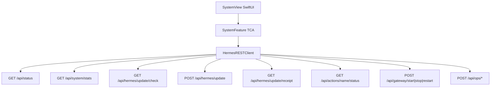

# Hermes Mobile — System / Host / Update management surface

## Overview

Port the Hermes web dashboard **System** panel into hermes-mobile over authenticated
dashboard REST (no SSH, no push-plugin changes). Phases 1–6 of
[`2026-08-26-management-surface-port.md`](2026-08-26-management-surface-port.md) are
already shipped; this plan covers Host stats, Hermes self-update, gateway lifecycle,
Operations actions, richer status/OOM surfacing, then the remaining Phase 6+ admin
surfaces as a second track.

Upstream reference:
https://hermes-agent.nousresearch.com/docs/user-guide/features/web-dashboard

## Context

The push plugin + gateway are **notify-only** and stay untouched. Privileged host ops
use the same pattern as Skills / Env / push-plugin update: `HermesRESTClient` +
capability gate on 404/405 + `AuthSession`. Long jobs reuse / extend the existing
`actionStatus` poller (`SkillsFeature.pollAction`).

Hermes agent update **is** viable via first-party APIs:

| API | Role |
|-----|------|
| `GET /api/hermes/update/check` | Behind / install method / commit list (`?force=1`) |
| `POST /api/hermes/update` | Spawns `hermes update` (background) |
| `GET /api/actions/hermes-update/status` | Poll + receipt summary after dashboard restart |
| `GET /api/hermes/update/receipt` | Durable receipt (success across restart gap) |

**Gotcha (LOAD-BEARING):** a successful update often **restarts the dashboard**, wiping
in-memory action registries. Desktop treats a finished **update receipt** whose run
started at/after apply as authoritative — mobile must mirror that, not infer failure
from `exit_code == null` after reconnect. See upstream #81193 / #87359 / receipt PRs.

Docker / Nix / package installs: check returns non-updatable + out-of-band command;
UI shows copyable command, no Apply button.

## Locked product decisions

| Decision | Choice |
|----------|--------|
| Entry | Settings → **System** + More menu → **System** (same sheet, list-hosted like Skills) |
| Push sidecar | Unchanged — never a command channel |
| Confirmations | TCA `ConfirmationDialogState` + `.bottomActionSheet` for Update / Restart / Stop / Restore |
| Destructive restore / import | Deferred to Phase C2 (backup download first; restore needs file pick + upload) |
| Shell hooks create/delete | Out of this plan (arbitrary host command surface) — read-only list deferred with hooks |
| Capability gates | `RESTError.isMissingEndpointVerdict` → hide System entry / per-section |
| Profile scoping | Host/update/ops are install-wide — **no** `?profile=` (unlike skills/env) |
| Action poll | Extend `DashboardActionStatus` for `running` / `exit_code` / `lines` / receipt summary; shared poll helper extracted from Skills |
| Reconnect during update | Expect socket/REST blip; surface “Updating… reconnecting” then re-check receipt + `GET /api/status` version |
| Config / env apply | After successful `PUT /api/config` or `PUT`/`DELETE /api/env`, offer **Restart gateway to apply** when `gatewaySupported` (same `POST /api/gateway/restart` as System). Decline keeps the written file; new sessions may still pick some values up. |
| Soft `/reload` | No first-party REST `.env` reload today (CLI slash only). Do **not** invent one; do not auto-submit `/reload` as chat text. Env edits use the restart offer. In-session `config.set` (model/reasoning) stays immediate and does **not** prompt restart. |

## Architecture

Reuse:

- [`HermesRESTClient.actionStatus`](HermesKit/Sources/HermesKit/Clients/HermesRESTClient.swift) + [`DashboardActionStatus`](HermesKit/Sources/HermesKit/Models/Skill.swift)
- Skills hub poll loop pattern in [`SkillsFeature`](HermesKit/Sources/HermesKit/Features/SkillsFeature.swift)
- Ops strip already paints coarse pressure from `/api/status` — System is the detail surface; strip stays compact
- Settings Management section + SessionList More menu (Skills/Workspaces pattern)

## Phase map

### Phase S0 — Plan + feature doc stub

| Artifact | Location |
|----------|----------|
| This plan | `docs/plans/completed/2026-08-30-system-management-surface.md` |
| Feature doc | `docs/features/system-management.md` (invariants; expand as phases land) |
| Pointer | Append System section to `docs/features/management.md`; CLAUDE “Management” bullet if present |

### Phase S1 — Models + REST client (no UI)

| API | Client method | Models |
|-----|---------------|--------|
| `GET /api/system/stats` | `systemStats` | `SystemStats` (OS, kernel, arch, hostname, python/hermes versions, CPU, memory, disk, uptime, load — lenient decode) |
| `GET /api/hermes/update/check` | `hermesUpdateCheck(force:)` | `HermesUpdateCheck` (`behind`, `install_method`, `can_update`, `commits[]`, `command` for non-git) |
| `POST /api/hermes/update` | `hermesUpdate` | Returns action name / accepted |
| `GET /api/hermes/update/receipt` | `hermesUpdateReceipt` | `HermesUpdateReceipt` (outcome, steps summary, started_at) |
| `POST /api/gateway/start\|stop\|restart` | `gatewayLifecycle(_:)` | Enum `GatewayLifecycleAction` |
| `POST /api/ops/doctor\|security-audit\|backup\|prompt-size\|dump\|config-migrate` | `opsAction(_:)` | Enum `OpsAction` → action name to poll |

Extend `DashboardActionStatus` (additive, lenient): `running: Bool?`, `exitCode: Int?`, `pid: Int?`, `lines: [String]?`, receipt summary fields when present. Keep Skills decoding green.

Enrich `ServerStatus` / `ResourcePressure` decode for OOM fields used by S3 banners:
`last_boot_unclean`, `last_boot_suspected_oom`, `boot_id`, `system_available_mb`, `used_percent` — display helpers only; ops strip can optionally show OOM hint later.

Tests: decode fixtures from documented JSON shapes; 404 → `RESTError`; method path assertions like `updatePushPlugin` tests.

### Phase S2 — `SystemFeature` + Host / Update UI

New TCA feature in HermesKit: `SystemFeature` (connection in state, like `SkillsFeature` / `EnvFeature`).

State highlights:

- `stats`, `updateCheck`, `receipt`
- `systemSupported` / `updateCheckSupported` / `gatewaySupported` / `opsSupported` (flip on first missing-endpoint)
- `inFlightAction` + log lines + banner
- `@Presents` confirmation for Apply update

Behavior:

- `.task` loads stats + update check in parallel
- Pull-to-refresh / Check again → `hermesUpdateCheck(force: true)`
- Apply (git + `can_update`) → confirm → `hermesUpdate` → poll `hermes-update` status; on REST blip, poll `hermesUpdateReceipt` until terminal or timeout (~3–5 min, TestClock)
- Non-updatable → show install method + copyable command (reuse copy-with-feedback token idiom)
- 404 on stats → `systemSupported = false` (hide entry); partial 404 on update check alone hides Update section only

UI: `SystemView` Form sections — **Host**, **Hermes update**, (placeholders disabled until S3/S4). Entry from Settings Management + More, gated by `systemSupported` (probe on Settings `.task` / list appear via lightweight `systemStats` or dedicated capability probe — prefer first open of System sheet with silent fail-back, **or** probe `GET /api/system/stats` once from Settings task mirroring env/skills).

Mirror Skills: parent sets `skillsSupported` from prior probe — Settings already probes skills/env/fs. Add `systemSupported` the same way (one HEAD/GET probe).

Snapshots: pin explicit height for any scrollable System form subsection under test; `dynamicTypeSize(.large)`.

### Phase S3 — Gateway lifecycle + status banners + post-edit restart

| Control | API | UI |
|---------|-----|-----|
| Start / Stop / Restart | `POST /api/gateway/{action}` | Buttons + confirm for Stop/Restart; disable while action in flight |
| Live state | Existing `ServerStatus.gatewayState` + refresh | Label in Gateway section |
| Restart after config/env write | Same `restart` | Settings / Env success path → confirmation (“Restart gateway to apply these changes?”) → shared restart effect |

Hermes documents that dashboard **config.yaml** edits take effect on the next agent
session **or gateway restart**; messaging-channel credential flips likewise need a
restart. Mobile already writes via `putConfig` / `putEnv` / `deleteEnv` — S3 wires the
missing apply step:

1. Extract a small shared restart effect (or `AppFeature` / parent delegate) callable
   from `SystemFeature` **and** `SettingsFeature` / `EnvFeature` so System’s Restart
   button and the post-edit prompt share one code path + confirm copy.
2. On successful config quick-edit save or env set/delete: if `gatewaySupported`,
   present the restart confirmation (not auto-restart). Cancel dismisses; files stay
   written. If gateway routes 404, show a short footnote only (“Restart the agent
   host for some changes to apply”) — no dead button.
3. While restart runs: disable composer-adjacent confusion via existing disconnect
   handling; refresh `ServerStatus` when reachable again.

After restart: expect brief disconnect; refresh status when reachable again (reuse
connection health, do not invent SSH).

Ops strip / System: if `last_boot_suspected_oom` / unclean boot present, show dismissible banner (session-scoped `@State` or reducer token; boot_id keyed so escalation re-shows — match desktop severity order lightly: critical disk/mem > OOM > elevated).

**Not in S3:** raw YAML editor, auto-restart without confirm, chat `config.set` prompts.

### Phase S4 — Operations actions

| Action | API | Notes |
|--------|-----|-------|
| Doctor | `POST /api/ops/doctor` | Poll + show tailed `lines` in a read-only log block |
| Security audit | `POST /api/ops/security-audit` | Same |
| Backup | `POST /api/ops/backup` | On success, surface path / download affordance if API returns URL; else “created on host” message |
| Prompt size | `POST /api/ops/prompt-size` | Same poll UI |
| Support dump | `POST /api/ops/dump` | Same |
| Config migrate | `POST /api/ops/config-migrate` | Confirm first |

Shared UI: one `ActionLogPanel` (running / success / failed + ScrollView lines). One action at a time (disable siblings while `inFlightAction != nil`).

**Deferred in S4 (explicit):**

- `POST /api/ops/import` / import-upload (needs document picker + multipart)
- Shell hooks mutate / checkpoints prune (high risk / niche)
- Live SSE log stream if any — stick to status poll `?lines=`

### Phase S5 — Docs + polish

- Expand `docs/features/system-management.md` to normative invariants
- Update `docs/features/management.md` System section
- Move this plan to `docs/plans/completed/` when S1–S4 shipped
- README short bullet under management features

### Phase S6+ — Remaining admin (second track; after System ships)

Sequenced separately so System lands first. Same REST + gate idioms; each as its own PR:

| Sub-phase | APIs | UI home |
|-----------|------|---------|
| S6a Memory | `GET/PUT /api/memory*`, `POST .../reset` | System or Settings → Memory |
| S6b Curator | `GET/PUT/POST /api/curator*` | System |
| S6c Portal (read-only) | `GET /api/portal` | System |
| S6d MCP | `/api/mcp/servers*`, catalog | Settings → MCP |
| S6e Webhooks | `/api/webhooks*` | Settings → Webhooks |
| S6f Messaging + pairing | `/api/messaging/*`, `/api/pairing*` | Settings → Channels |
| S6g Credential pool | `/api/credentials/pool*` | Near API Keys |

Still **out of scope** (carry forward from management plan): SSH/SFTP, Scarf fleet, raw YAML, FS mutations, push architecture changes, kanban unless a clear mobile UX appears, full MEMORY.md editors.

## Endpoint → client → feature → UI map (S1–S4)

| API | Client | Feature | UI |
|-----|--------|---------|-----|
| `GET /api/system/stats` | `systemStats` | `SystemFeature` | Host section |
| `GET /api/hermes/update/check` | `hermesUpdateCheck` | same | Update badge + commits |
| `POST /api/hermes/update` | `hermesUpdate` | same | Update now |
| `GET /api/hermes/update/receipt` | `hermesUpdateReceipt` | same | Post-restart success |
| `GET /api/actions/{name}/status` | `actionStatus` (extended) | same + Skills | Log tail |
| `POST /api/gateway/start\|stop\|restart` | `gatewayLifecycle` | same | Gateway controls |
| `POST /api/ops/*` (listed) | `opsAction` | same | Operations buttons |
| Enriched `/api/status` fields | existing `status` decode | System + optional strip | OOM / unclean banners |

## Test plan

| Phase | Tests |
|-------|--------|
| S1 | Decode fixtures (stats, check, receipt, enriched status); path/method assertions; lenient unknown fields; Skills `DashboardActionStatus` still decodes old fixtures |
| S2 | TestStore: load, 404 gates, apply confirm → poll → receipt success after simulated blip; non-updatable copy path; snapshot Host + Update |
| S3 | Gateway confirm + in-flight lock; post-config/env restart offer + cancel leaves files written; OOM banner boot_id dismiss; snapshot Gateway |
| S4 | Ops action poll terminal success/fail; single-flight mutual exclusion; snapshot Operations |
| S6* | Per-surface decode + gate + reducer tests (own PRs) |

Every phase: `script -q /dev/null swift test --package-path HermesKit` (or `make test`). New SwiftUI files need `tuist generate` before app/snapshot builds.

## Ship order

1. S0 — this plan (+ feature doc stub) — **this PR**
2. S1 — models + REST (can land without UI)
3. S2 — SystemFeature Host + Update (first user-visible)
4. S3 — Gateway + post-config/env restart offer + banners
5. S4 — Operations
6. S5 — docs finalize / move plan to completed
7. S6a–g — separate focused PRs

## Manual checklist (DoD for S1–S4)

- Sideload/build → login → More/Settings → System visible on recent agent
- Host shows OS / versions / pressure numbers
- Update check: behind count or up-to-date; Apply on git install completes with success **after** dashboard restart blip (receipt path)
- Non-git install: copyable command, no Apply
- Gateway Restart confirms and returns to Running
- Config quick-edit or API Key save offers Restart gateway; confirming applies; declining leaves the write in place
- Doctor runs and shows log lines
- Older agent without `/api/system/stats`: System hidden; chat + existing management still work
- Push register / taps unchanged

## Privacy

Never log update receipts’ full step dumps at info level in production clients; never log backup paths that embed secrets; ops log lines shown in UI only. Same rules as `management.md` for env/config.
